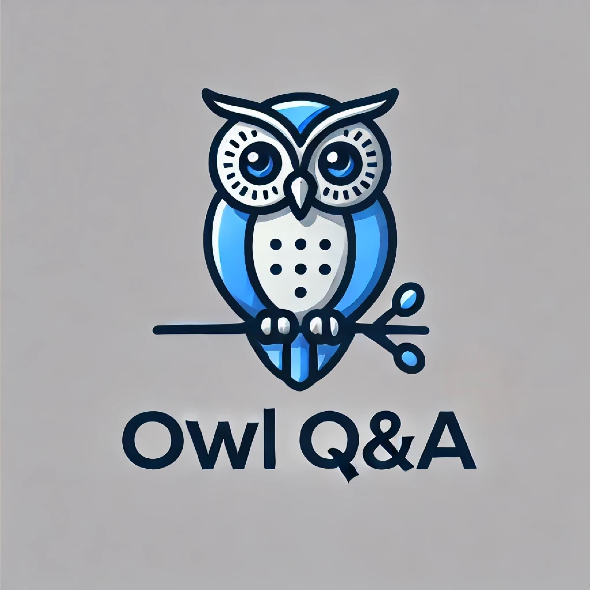

# Owl Q&A AI Bot

## Overview

Owl is an AI-powered Question and Answer bot designed to provide accurate and efficient responses to user queries. Built with Python, it leverages advanced natural language processing techniques to understand and generate human-like answers.

## Features

- **Natural Language Understanding**: Processes user input to comprehend context and intent.
- **Accurate Responses**: Utilizes AI models to generate precise answers.
- **Extensible API**: Designed with an API structure for easy integration and expansion.
